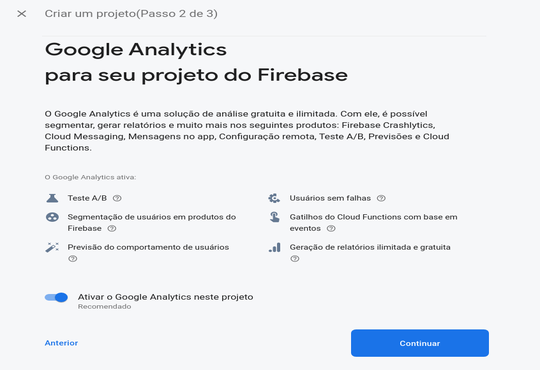
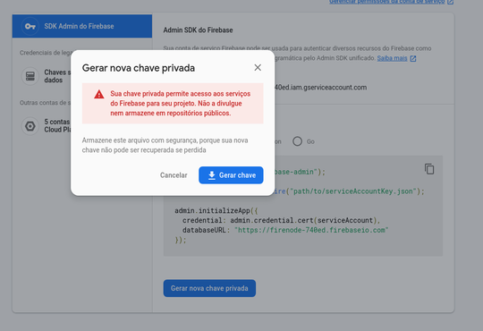

# FireNode

FireNode é um exemplo de como utilizar o banco de dados Firestore do Firebase junto com NodeJs.

## Configurando o Firebase

Basta ter uma conta do google  
Va na pagina inicial do [Firebase](https://firebase.google.com/) e vá em "Primeiros Passos"

Crie um novo projeto  
Depois preencha todos os campos para criar um novo Projeto

  
  
  
  

Va nas Configurações do Projeto no canto superior esquerdo.  
Adicione um App ao seu projeto.

  
  

Vá em "Contas de Serviços" e click em "Gerar nova chave privada", ele vai iniciar um download da chave privada em forma de Json.  
Renomei-e o arquivo baixado para "serviceAccountKey.json" e mova para dentro do repositório do projeto na pasta "config".

  

Agora basta criar a base de dados
Vá em Database no canto esquerdo no firebase e depois click em "Criar Banco de Dados"
Depois marque a opção de modo de teste.

  

E por fim selecione onde o banco de dados será criado.

## Iniciando o projeto

Para iniciar o projeto basta clonar o repositorio e usar o seguintes comandos dentro do diretorio FireNode

> yarn install  
> yarn dev
